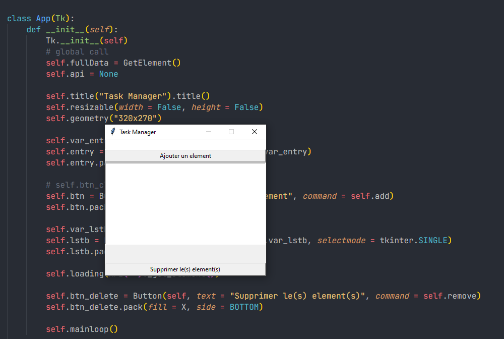

# Task-Manager
This is a simple task management application coded in python with an Object-Oriented approach to facilitate the addition of new features (CRUD).

I will add new features over time and of course the user interface will be updated.
The goal was to test myself, to put into practice my python skills on software development: OOP, Tkinter, json and programming logic.
---

## Upcoming features:
- User interface customization
- Task search
- Data export and import
- Autosave
- Priorities

---
##
@Ber1y
